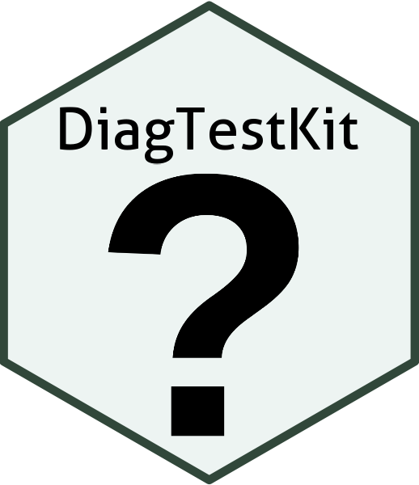

# DiagTestKit 

A package written by CVB Statistics to estimate the sensitivity and specificity of an experimental diagnostic test kit in accordance with [CVB STATWI0002](https://www.aphis.usda.gov/aphis/ourfocus/animalhealth/veterinary-biologics/biologics-regulations-and-guidance/ct_vb_statwi) supporting the 2018 revision to VSM 800.73.

## To install or update DiagTestKit

### From Github

From **within R**

1.  Installing current release

```         
## From source, all platforms, slow.
devtools::install_github("ABS-dev/DiagTestKit", ref = "0.6.9")
```

*See all historical releases [here](https://github.com/ABS-dev/DiagTestKit/releases)*

2. Installing work-in-progress on the main development branch 

```
devtools::install_github("ABS-dev/DiagTestKit")
```

### For CVB employees

After setting up Rstudio to work with [Package Manager](https://ncahconnect.usda.net/CVBverse/articles/package_manager.html), you can install the most recent version of `DiagTestKit` like so:

``` r
install.package("DiagTestKit")
```

You can install an archived version of `DiagTestKit` thus:

``` r
devtools::install_version('DiagTestKit', '0.5.0')
```

Refer to the [DiagTestKit overview](https://ncahrpackage.usda.net/client/#/repos/cvb-gitlab/packages/DiagTestKit/overview#package-details) on Package Manager to find a list of the archived versions.

## Package Vignettes:

[Getting Started](https://github.com/ABS-dev/DiagTestKit/blob/0.5.4/inst/doc/GettingStarted.pdf)

[Examples](https://github.com/ABS-dev/DiagTestKit/blob/0.5.4/inst/doc/ExamplesForFallibleReferenceTests.pdf)

[Manual](https://github.com/ABS-dev/DiagTestKit/blob/0.5.4/inst/doc/GettingStarted.pdf)

## Issues

Report any issues or requests on the package  [issues](https://github.com/ABS-dev/DiagTestKit/issues) page.
