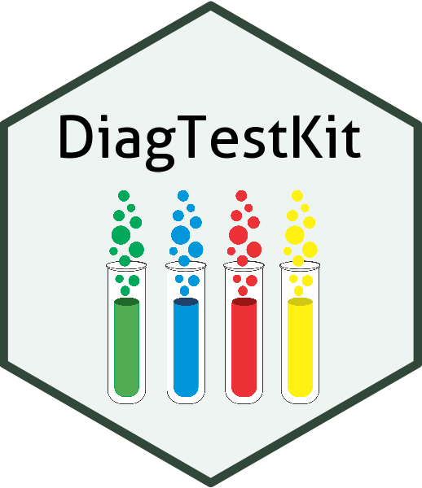

# DiagTestKit 

A package written by CVB Statistics to estimate the sensitivity and specificity of an experimental diagnostic test kit in accordance with [CVB STATWI0002](https://www.aphis.usda.gov/aphis/ourfocus/animalhealth/veterinary-biologics/biologics-regulations-and-guidance/ct_vb_statwi) supporting the 2018 revision to VSM 800.73.

## Installation

```         
devtools::install_github("ABS-dev/DiagTestKit")
```

## Vignettes

This package contains the following manuals and vignettes:

-   Examples
-   Getting Started

Type `vignette(package = "DiagTestKit")` to see a list of the included vignettes.


## Issues

Report any issues or requests on the package
[issues](https://github.com/ABS-dev/DiagTestKit/issues) page.
